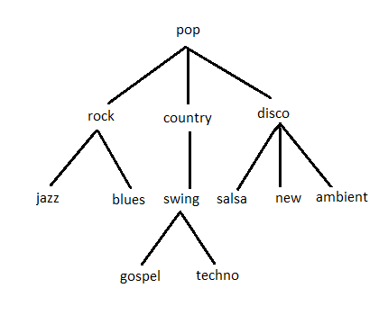
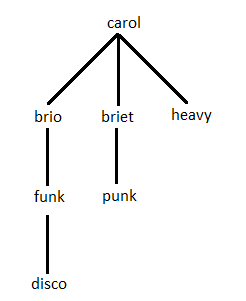

## F. Harmonic Homology :

### Problem Description :

There are several tunes in the music world. When these tunes are combined, we get a soothing melody. The combination of these melodies will result in a complete song.

Ananya is a musician who always tries to create unique songs. She mixes up these tunes together and forms melodies. There is a standard hierarchy for these tunes which resembles a tree. All the tunes that belong to a certain level sound alike, and the parent of these tunes defines their category.

The hierarchy will be given in the input. Ananya is currently composing a song, to make the song more musical, she will have to form melodies which sound similar.

You will be given the hierarchy of the tunes, two melodies, and three integers A, B and C. A melody is the chain of tunes separated by "-". Two tunes are said to be similar if they are equal or belong to the same level in the hierarchy. You are allowed to perform two operations on tunes i.e., compare or remove. A term "concordance score" is introduced, which is initially zero. When you compare, if tunes are similar, then concordance score will be increased by A or else decreased by B. If you prefer to remove a tune from one of the string, concordance score will be decreased by C. You cannot remove tune at ith index from both the strings simultaneously. You will have to move to the next tune only when the current tune is either compared or removed.

Ananya is trying to increase the similarity between the given melodies by increasing their concordance score by performing the above-mentioned operations. Thus, the more the concordance score, more the similarity!

Help Ananya in finding the maximum concordance score possible.

**Note:** These terms used here do not resemble original music terms.

### Constraints :

1 <= number of tunes in each melody <= 500

1 <= A, B, C <= 10^4

Tunes contains only lower-case alphabets.

### Input :

The first line consists of a single integer N denoting the number of parent nodes.

Next N lines contains music categories in the form of `<parent tune>` : `<list of child tunes separated by space>`. The first parent tune is always the root node of the tree.

N+2 line consists of melody m1.

N+3 line consists of melody m2.

The last line consists of three integers A, B and C.

### Output :

Print the maximum concordance score of the given melodies.

### Time Limit (secs) :

1

### Examples

---

**Example 1 :**

**Input :**

5

pop : rock country disco

rock : jazz blues

country : swing

disco : salsa new ambient

swing : gospel techno

rock-swing-new-salsa-swing-blues

swing-swing-blues-jazz

4 2 1

**Output :**

14

**Explanation :**

Given hierarchy is.

<!--  -->

Given melody1 = *rock-swing-new-salsa-swing-blues* and melody2 = *swing-swing-blues-jazz*

Steps followed to get maximum concordance score:

Remove rock and swing tunes from melody1. Melody1 becomes *new-salsa-swing-blues. *Concordance Score = -2

Compare *new* tune from melody1 with *swing* tune from melody2. Both are similar. Concordance Score = -2+4 = 2

Compare *salsa* tune from melody1 with *swing* tune from melody2. Both are similar because both are at the same level. Concordance Score = 2 + 4 = 6

Compare *swing* tune from melody1 with *blues* tune from melody2. Both are similar because both are at the same level. Concordance Score = 6 + 4 = 10

Compare *blues* tune from melody1 with *jazz* tune from melody2. Both are similar because both are at the same level. Concordance Score = 10 + 4 = 14

No other set of operations will give a concordance score greater than 14.

---

**Example 2 :**

**Input :**

4

carol : brio briet heavy

brio : funk

briet : punk

funk : disco

punk-brio-funk-briet

disco-carol-heavy-brio

10 8 2

Output

12

**Explanation :**

Given hierarchy is.

<!--  -->

Given melody1 = *punk-brio-funk-briet* and melody2 = *disco-carol-heavy-brio*

Steps followed to get maximum concordance score:

Remove* punk *tune from melody1. Melody1 becomes *brio-funk-briet* *. *Concordance score = 0 - 2 = -2

Remove *disco, carol *tunes from melody2. Melody2 becomes  *heavy-brio* . Concordance score= -2 - 4 = -6

Compare *brio* from melody1 and *heavy* from melody2. Both are similar because both are at the same level. Concordance Score = -6 + 10 = 4

Remove *funk* from melody1. It becomes  *brio-briet* . Concordance score = 4 - 2 = 2

Compare *briet* from melody1 and *brio* from melody2. Both are similar because both are at the same level. Concordance Score = 2 + 10 =12

No other set of operations will give concordance score greater than 12.

---